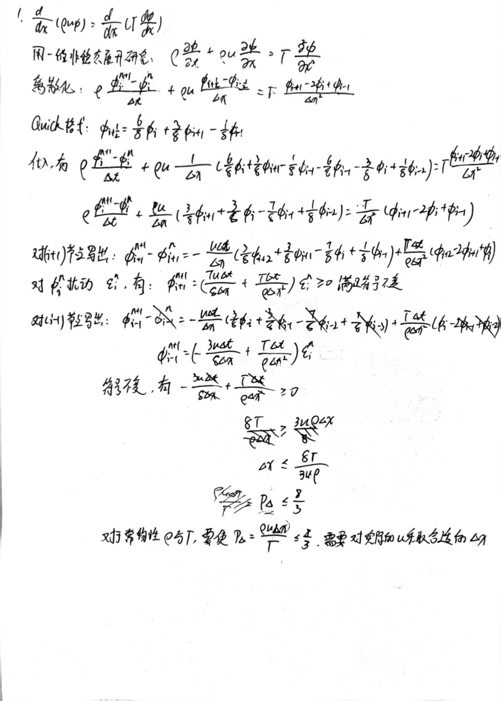

# 题目

# EX1

# EX2
二维稳态无源项对流-扩散问题，已知 $\rho u=5,\rho v=3,\Gamma=0.5$ ,四边界上 $\phi$ 值已知。试利用一阶迎风格式计算图中节点的 $\phi$ 值。

# 分析
## 过程
- 微元控制方程
- 离散控制方程并结构化——处理成结构标准的代数方程
- 边界条件考虑
- 迭代求解方程组

# 解
## 控制方程
二维稳态无源项的对流-扩散方程 $$\rho u\frac{\partial\phi}{\partial x}+\rho v\frac{\partial\phi}{\partial y}=\Gamma\left(\frac{\partial^2\phi}{\partial x^2}+\frac{\partial^2\phi}{\partial y^2}\right)$$ 
## 离散并结构化
离散方程每一项：
- 对流项离散格式：u,v>0的一阶迎风格式 

  $$\rho u\frac{\phi_{i,j}-\phi_{i-1,j}}{\Delta x}$$

  $$\rho v\frac{\phi_{i,j}-\phi_{i,j-1}}{\Delta y}$$

- 扩散项：一般的中心差分 $$\frac{\phi_{i+1,j}-2\phi_{i,j}+\phi_{i-1,j}}{\Delta x^2}$$

代入离散项，离散整体方程并处理： 
$$({\Delta x}\rho u+{\Delta y}\rho v+4\Gamma)\phi_{i,j}-({\Delta x}\rho u+\Gamma)\phi_{i-1,j}-\Gamma\phi_{i+1,j}-({\Delta y}\rho v+\Gamma)\phi_{i,j-1}-\Gamma\phi_{i,j+1}=0$$ 

代入数值： $$3.6\phi_{i,j}-1.5\phi_{i-1,j}-0.5\phi_{i+1,j}-1.1\phi_{i,j-1}-0.5\phi_{i,j+1}=0$$ 

## 边界条件
上边： $\phi$ = 200

下边： $\phi$ = 100

左边： $\phi$ = 50

右边： $\phi$ = 300